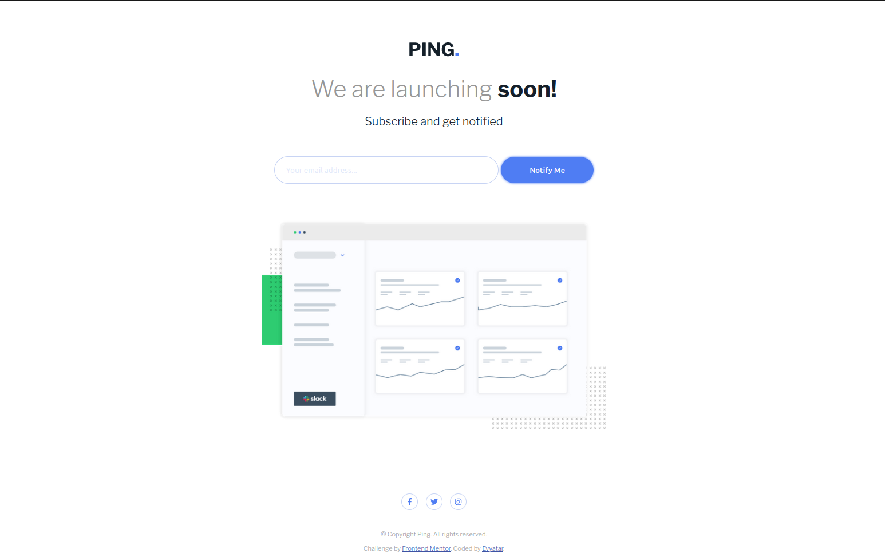

# Frontend Mentor - Ping coming soon page solution

This is a solution to the [Ping coming soon page challenge on Frontend Mentor](https://www.frontendmentor.io/challenges/ping-single-column-coming-soon-page-5cadd051fec04111f7b848da). Frontend Mentor challenges help you improve your coding skills by building realistic projects. 

## Table of contents

- [Overview](#overview)
  - [The challenge](#the-challenge)
  - [Screenshot](#screenshot)
  - [Links](#links)
  - [Built with](#built-with)
  - [What I learned](#what-i-learned)
  - [Continued development](#continued-development)
  - [Useful resources](#useful-resources)
- [Author](#author)

**Note: Delete this note and update the table of contents based on what sections you keep.**

## Overview

### The challenge

Users should be able to:

- View the optimal layout for the site depending on their device's screen size
- See hover states for all interactive elements on the page
- Submit their email address using an `input` field
- Receive an error message when the `form` is submitted if:
	- The `input` field is empty. The message for this error should say *"Whoops! It looks like you forgot to add your email"*
	- The email address is not formatted correctly (i.e. a correct email address should have this structure: `name@host.tld`). The message for this error should say *"Please provide a valid email address"*

### Screenshot

### Links

- Solution URL: [https://github.com/Evyatarr/Ping-single-column-coming-soon-page](https://github.com/Evyatarr/Ping-single-column-coming-soon-page)
- Live Site URL: [https://evyatarr.github.io/Ping-single-column-coming-soon-page/](https://evyatarr.github.io/Ping-single-column-coming-soon-page/)

### Built with

- Semantic HTML5 markup
- CSS custom properties
- Flexbox
- Mobile-first workflow
- Vanilla JavaScript

### What I learned

This project was my second one in frontednmentor.io,
Which gave me more expierence in CSS and flexbox, I came to this project with better knowledge and more confidence.
In addition, This project was built using JavaScript, which I enjoyed coding in.
I've learned a new way to implement vanilla JS in HTML & CSS

### Continued development

I want to continue to code in JavaScript in the future, also, I want to learn to use CSS Grid better. 
I feel like I'm comfortable with Flexbox and would like to expand my knowledge with Grid.

### Useful resources

- [Font Awesome](https://fontawesome.com/) - Helped me with media logos.
- [W3Schools](https://www.w3schools.com/) - The Frontend developer's bible.

## Author

-Portfolio Website - [https://evyatarr.github.io/portfolio-website/](https://evyatarr.github.io/portfolio-website/)
- Frontend Mentor - [@evyatarr](https://www.frontendmentor.io/profile/evyatarr)
